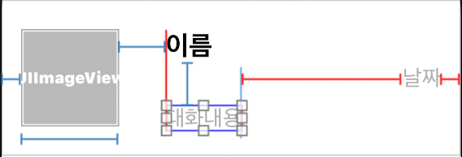
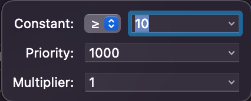

# UICollectionView를 활용한 채팅 리스트 구현


## Flow

1. Storyboard에 viewController 지정

2. collectionView를 가져와서 autolayout 설정
   1. Collection View Cell 안에 채팅 리스트에 맞는 imageview, label 추가
   2. autolayout 설정
3. UICollectionViewCell 생성
   1. collectionViewCell의 class에 할당
   2. 재사용되는 cell이기 때문에 resuableview의 identifier에도 할당
4. content view 안의 image view, label들을 연결
5. viewController에 collectionViewController 연결
   1. Data, Presentation - **dataSource**
   2. Layout - **delegate**


## 개념

### Content Hugging Priority  VS  Content Compression Resistance Priority

- Content Compression Resistance Priority가 클수록 자신의 영역을 유지할 수 있다.


### 날짜 표시 방법

- 2022-03-22 형태의 날짜를 03/22 형태로 바꾸기

  - DateFormatter() 이용

  ```swift
  func formattedDateString(dateString: String) -> String {
    // String -> Date -> String
    let formatter = DateFormatter()
    formatter.dateFormat = "yyyy-MM-dd"
  
    if let date = formatter.date(from: dateString) {
      formatter.dateFormat = "M/d"
      return formatter.string(from: date)
    } else {
      return ""
    }
  }
  ```

  


## Warnings

1. 대화내용 - 날짜 사이 horizontal spacing == 10으로  autolayout 잡아줄 때 warning 발생



- 해결



