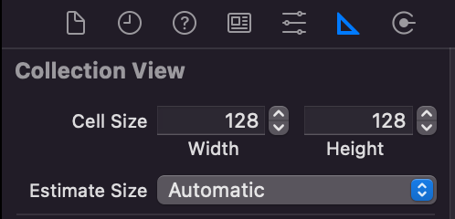

# UITapBarController

.gif)


## UICollectionViewCell

- 재사용 되기 전 준비하기 위한 함수

  ```swift
  override func prepareForReuse() {
    super .prepareForReuse()
  
    // 기존 이미지 Reset
    thumbnail.image = nil
  }
  ```

  

## 이론

- collectionViewLayout 관련 사용자 지정 layout 사용하기 위한 코드(programmatically)

```swift
    override func viewDidLoad() {
        super.viewDidLoad()
        
      	// 사용자 지정 layout 사용
        if let flowlayout = collectionView.collectionViewLayout as? UICollectionViewFlowLayout {
            flowlayout.estimatedItemSize = .zero
        }
    }
```

- storyboard에서는 Estimate Size를 none로 변경해주기 (default값은 Automatic)




### 검색 뷰 넣기

```swift
override func viewDidLoad() {
super.viewDidLoad()

self.navigationItem.title = "Search"
let searchController = UISearchController(searchResultsController: nil)
searchController.hidesNavigationBarDuringPresentation = false
searchController.searchBar.placeholder = "Search"
  
searchController.searchResultsUpdater = self  // UISearchResultsUpdating protocol 필요
  
self.navigationItem.searchController = searchController
}
```

```swift
extension SearchViewController: UISearchResultsUpdating {
    func updateSearchResults(for searchController: UISearchController) {
        let search = searchController.searchBar.text
        print("Result: \(search)")
    }
}

```

