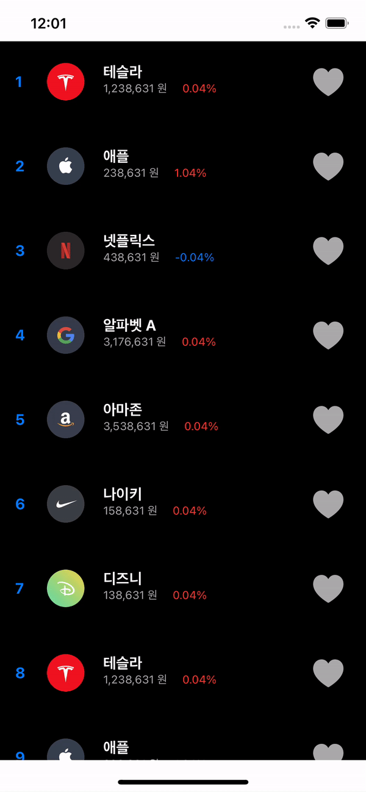

# UICollectionView

: 여러 데이터를 여러 컬럼 또는 레이아웃 커스터마이징해서 표현해주는 뷰 (예: 그리드뷰)

- UICollectionView를 활용해 리스트 또는 그리드를 구현할 수 있다.

### 개념

1. Data
   - 어떤 데이터를 쓸 것인지
2. Presentation
   - Cell을 어떻게 표현할 것인지
3. Layout
   - Cell들의 Layout을 어떻게 구현할 것인지


## Flow

1. collectionView 생성, Content View 안에 표현할 아이템을 배치한다. (autolayout)

2. 생성한 UICollectionView를 collectionView 변수로 연결하고, delegate를 설정한다.

   ```swift
   class StockRankViewController: UIViewController {
       
       let stockList: [StockModel] = StockModel.list
   		
     	// UICollectionView 연결
       @IBOutlet weak var collectionView: UICollectionView!
       
       override func viewDidLoad() {
           super.viewDidLoad()
   
           // collectionView delegate 설정
           collectionView.delegate = self
           collectionView.dataSource = self
       }
   }
   ```

   

3. StockRankCollectionViewCell을 정의한다.

   ```swift
   class StockRankViewController: UIViewController {
       
       let stockList: [StockModel] = StockModel.list
   
       @IBOutlet weak var collectionView: UICollectionView!
       
       override func viewDidLoad() {
           super.viewDidLoad()
   
           // collectionView delegate 설정
           collectionView.delegate = self
           collectionView.dataSource = self
       }
   }
   ```

4. cell에 대한 delegate를 정의한다.

   1. 아이템의 개수 : collectionView(_:numberOfItemsInSection:)

   2. 셀 생성 : collectionView(_:cellForItemAt:)

      

5. cell의 layout에 대한 delegate를 설정한다.

   1. cell사이즈 : collectionView(_:layout:sizeForItemAt:)

   


## UICollectionView를 활용한 주식 리스트 구현 예시

